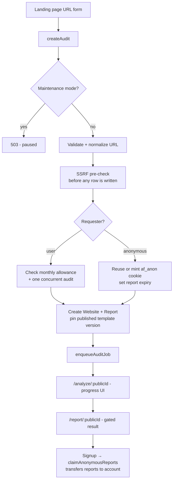

# AuditFlow — System Overview

> A study of the codebase as it stands, written as a basis for planning.
> Grounded in the source **and** in the live Neon database (surveyed 2026-07-29).
> Where this document states a number, it came from the database, not from the code's intent.

---

## 1. What this product is

A **freemium website-audit SaaS**.

A visitor pastes a URL on the landing page with no account. They watch a staged
progress animation while the site is crawled and scored, then land on a report
covering Page Speed, SEO, Technical SEO, Accessibility, Mobile Usability,
Security, and Conversion Optimization.

The report is deliberately gated:

| Viewer | Sees |
|---|---|
| Anonymous | Overall score + section names, everything else locked |
| Free account | Full detail on FREE/BOTH content; PREMIUM content locked |
| Premium account | Everything |

Monetization is a Stripe subscription. Free accounts get a monthly audit
allowance (3 by default, configurable); Premium gets a larger one.

**The conversion funnel is the product's spine, not a bolt-on.** An anonymous
audit is tied to a hashed cookie token. On signup, the reports created under
that cookie are transferred to the new account and their expiry is cleared, so
the user gets the result they were already waiting for without re-running
anything. That "your report is ready, just sign in" moment is the core
acquisition mechanic.

---

## 2. The central architectural bet

**The audit engine is configuration, not code.**

Not one check is hardcoded. A `MASTER_ADMIN` composes the entire audit through a
builder UI: sections, checks, thresholds, severity, scoring weights, per-plan
visibility, and the exact prose shown for each outcome.

This is why the schema carries 34 `InspectionType` values and 16
`CriteriaOperator` values — they are the vocabulary an admin composes from, not
an enumeration of features someone hardcoded.

### Why this matters

- New checks ship without a deploy.
- Scoring can be retuned per-section by weight, live.
- The free/premium split is a per-section and per-check dropdown, so the paywall
  can be repositioned without touching code.
- The same engine powers the admin's "Test this criterion against a URL" feature,
  so a check is verified before it ever reaches a customer.

### The safety consequence

Because admins configure behavior, the system must never let them configure
*execution*. It doesn't:

- `RULES_EVALUATOR` is a **sandboxed JsonLogic interpreter**
  (`src/services/criteria/extract-value.ts` → `evaluateRules`) with a whitelisted
  operator table, a depth-20 recursion guard, and reads restricted to paths
  inside the extracted crawl data. Unknown operators return `null` silently.
- `REGEX_EVALUATOR` patterns are length-capped (300 chars), screened against
  catastrophic-backtracking shapes, and run against a 50KB-truncated subject.
- **No executable code is ever stored in the database.** The schema comment says
  it outright: JsonLogic is "the safe replacement for custom JavaScript."

---

## 3. Data model spine

Four clusters, ~34 models.

### Builder (the template)

```
ReportTemplate
  └── TemplateVersion        (DRAFT | PUBLISHED | ARCHIVED)
        └── ReportSection    (weight, planAccess, contributesToScore)
              └── AuditField (severity, score, weight, planAccess)
                    ├── AuditCriteria    (1:1 — how to inspect + how to judge)
                    └── AuditSuggestion  (1 per outcome status — what to say)
```

### Execution (the result)

```
Website
  └── Report                 (pins templateVersionId — never "latest")
        ├── WebsiteRawData   (1:1 — full crawl snapshot incl. up to 2MB HTML)
        ├── PageSpeedResult  (1 per strategy: MOBILE / DESKTOP)
        ├── ReportSectionResult
        │     └── AuditResult (1 per field — status, value, rendered prose)
        └── ReportSnapshot   (1:1 — immutable denormalized payload)
```

### Identity & billing

`User`, `Session` (revocation registry — JWT is primary), `AnonymousSession`,
`VerificationToken`, `PasswordResetToken`, `Plan`, `PlanFeature`, `Subscription`,
`Payment`, `Invoice`, `StripeWebhookEvent` (idempotency ledger).

`Organization` / `OrganizationMember` exist but are **not surfaced in the v1 UI** —
they're future-proofing for multi-seat.

### System

`SystemSetting` (typed KV), `BrandingSetting`, `EmailTemplate`,
`AdminActivityLog` (before/after diffs), `ApiUsage`, `Notification`,
`SystemExecutionLog` (pipeline tracing).

---

## 4. Immutability — three layers

The hardest problem in a configurable audit tool is: *an admin edits a check;
what happens to the 10,000 reports already delivered?* This codebase answers it
three times over.

1. **Template versions freeze on publish.**
   The admin always edits a `DRAFT`. Publishing marks it `PUBLISHED` and
   immediately deep-clones a fresh `DRAFT` so editing continues
   (`publishDraftAction` → `cloneVersionAsDraft`). Every report pins its
   `templateVersionId` at intake.

2. **The crawl is persisted, so re-evaluation never re-crawls.**
   `WebsiteRawData` holds the extracted data *and* the page HTML.
   `evaluateReport()` is explicitly deterministic and idempotent — it deletes and
   rewrites results from stored inputs, producing identical output every run.

3. **The finished report is snapshotted.**
   `buildAndStoreSnapshot()` writes a denormalized JSON payload. The report UI
   and future PDF export read *that*, never the live builder tables.

**Verified in the live DB:** `v1 PUBLISHED` (7 sections) holds all 14 reports;
`v2 DRAFT` (8 sections) holds 0. The mechanism works.

---

## 5. The two flows

### 5a. Intake → report (the funnel)



### 5b. The audit pipeline

`runAudit(reportId)` — 10 stages, each writing progress to the DB so the
progress UI can poll it.

| Stage | % | What happens |
|---|---|---|
| CONNECTING | 5 | Re-validate URL, re-check SSRF |
| FETCHING_HTML | 12 | `fetchPage()` — static HTML |
| RENDERING | 22 | Playwright render + screenshot — **optional-fail by design** |
| INSPECTING_METADATA | 32 | `extractFromHtml()` — uses rendered DOM if >20% richer |
| CHECKING_SEO | 42 | robots.txt, sitemap, broken links → **persist raw-data checkpoint** |
| CHECKING_SPEED | 55 | PageSpeed Insights, both strategies |
| REVIEWING_ACCESSIBILITY → PREPARING_RECOMMENDATIONS | 68–90 | Progress-only stages (no work — see §10) |
| GENERATING_REPORT | 96 | `evaluateReport()` + `buildAndStoreSnapshot()` |
| — | 100 | `COMPLETED`, or `PARTIAL` if PSI returned nothing |

Rendering failing does **not** fail the audit — static HTML plus PSI covers most
checks. That's a good resilience call.

---

## 6. The criteria engine

Three pure stages, shared by both the report engine and the admin's live test tool.

```
AuditCriteria + crawl snapshot
        │
        ▼
[1] extract-value.ts   → { kind: string|number|boolean|unavailable }
        │
        ▼
[2] evaluate.ts        → PASS | WARNING | FAIL | ERROR | NOT_APPLICABLE
        │
        ▼
[3] interpolate.ts     → "Your LCP is 3200ms — above the recommended 2.5s."
```

**The two-band design** is the elegant part. Each criterion has a *pass* band and
an optional *warn* band:

```
LCP  ≤ 2500ms          → PASS
     ≤ 4000ms (warn)   → WARNING
     otherwise         → FAIL
```

Both bands are just `operator + expectedValue/min/max` rows — fully admin-configurable.

**Status semantics:**

| Status | Scores as | Meaning |
|---|---|---|
| PASS | 1.0 | Met |
| WARNING | 0.5 | Partially met |
| FAIL | 0.0 | Not met |
| NOT_APPLICABLE | excluded | PSI data absent — deliberately not penalized |
| ERROR | excluded | Misconfigured check — doesn't punish the customer |

**Scoring:** section score = Σ(field.score × field.weight × statusFactor) / Σ(max).
Overall = weighted average of section *percentages* by `section.weight`, so a
section's check count doesn't distort its influence. Grade comes from the
`score_ranges` system setting — configurable, not hardcoded.

**Quick wins:** a FAIL/WARNING whose severity is LOW or MEDIUM — i.e. high
impact-to-effort ratio, meant to drive the "fix these three things first" UX.

---

## 7. Plan gating is a real server boundary

`src/services/reports/project-report.ts` is the security-relevant file.

Locked premium content is reduced to a **title-only stub before serialization**.
Detected values, messages, suggestions, and evidence for locked checks never
reach a free viewer's browser. As the code comment puts it: *"the blur is real
absence."*

| planAccess | FREE viewer | PREMIUM viewer |
|---|---|---|
| `BOTH` / `FREE` | full | full |
| `PREMIUM` | locked stub | full |
| `HIDDEN` | omitted | omitted |

Related: the unguessable 21-char `publicId` is deliberately **not** sufficient by
itself. `getReportForViewer()` requires session ownership, a matching anonymous
cookie (only while unclaimed and unexpired), or `MASTER_ADMIN`.

---

## 8. Security posture

Above average for a project this size:

- **SSRF** — DNS-resolution checks at intake *and* again before fetch; Playwright
  route-interception aborts subresource requests to raw private IPs.
- **Passwords** — argon2id (`@node-rs/argon2`).
- **Tokens** — every token (verification, reset, anonymous session) stored as a
  SHA-256 hash; the raw value only ever exists in the email or the cookie.
- **Account protection** — `failedLoginAttempts` + `lockedUntil`.
- **Stripe** — signature-verified webhooks with a `StripeWebhookEvent`
  idempotency ledger.
- **Admin** — every server action re-verifies role server-side rather than
  trusting middleware; every mutation is written to `AdminActivityLog` with
  before/after payloads.
- **Headers** — X-Frame-Options DENY, nosniff, Referrer-Policy, Permissions-Policy.

---

## 9. Admin surface (`/master-admin`)

| Route | Purpose |
|---|---|
| `/builder` | The heart — sections, fields, criteria, suggestions, reorder, duplicate, JSON import, publish, **test criterion against a live URL** |
| `/users` | Role/plan management |
| `/settings` | System settings + PageSpeed API key |
| `/reports` | All reports across users |
| `/logs` | `SystemExecutionLog` viewer — pipeline tracing |

The "test against URL" action is rate-limited to 20/hour per admin and runs the
real extract→evaluate path with PSI stubbed out, so it's fast and honest.

---

## 10. Current state — what's actually built

**Essentially feature-complete through the report UI.** 111 TS/TSX files, ~944-line
schema, only two genuinely unimplemented inspection types (`HTML_VALIDATION`,
`API_CHECK`) which return a clean `unavailable` rather than crashing.

Live database, 2026-07-29:

```
Users:    3 (1 MASTER_ADMIN, 2 USER — all PREMIUM)
Plans:    2        Settings: 11        Templates: 1
Versions: v1 PUBLISHED (7 sections, 20 checks) — 14 reports
          v2 DRAFT     (8 sections, 21 checks) —  0 reports
Reports:  14 total → 3 COMPLETED, 2 PARTIAL, 5 FAILED, 4 stuck PROCESSING
Snapshots: 2      RawData: 7      PSI rows: 8      ExecLogs: 19
Anon sessions: 12 (none expired yet)
```

`PARTIAL` means the audit finished but PageSpeed returned nothing — a usable
report minus speed metrics. So **5 of 14 produced a deliverable report; 9 did
not.**

Note the mismatch worth a look: 5 reports reached a terminal success state but
only **2 snapshots** exist. Since `buildAndStoreSnapshot()` runs immediately
before finalization, three finished reports appear to lack the payload the
report UI reads from.

Published v1 sections:

| # | Section | Weight | Access | Checks |
|---|---|---|---|---|
| 1 | Page Speed | 2.0 | BOTH | 3 |
| 2 | SEO | 2.0 | BOTH | 5 |
| 3 | Technical SEO | 1.5 | BOTH | 4 |
| 4 | Accessibility | 1.5 | BOTH | 3 |
| 5 | Mobile Usability | 1.5 | BOTH | 1 |
| 6 | Security | 1.5 | BOTH | 2 |
| 7 | Conversion Optimization | 1.0 | **PREMIUM** | 2 |

The two most recent successful audits both scored **84.5 / "Good"** with
16 pass / 1 fail / 3 warning — the full pipeline demonstrably works end to end.

### Gaps worth noting

- **Stages 68–90 do no work.** `REVIEWING_ACCESSIBILITY`, `ANALYZING_MOBILE`,
  `CHECKING_CONVERSION`, `PREPARING_RECOMMENDATIONS` only move the progress bar.
  All real work happens at 42%, 55%, and 96%. This is progress *theater* — fine
  as a UX choice, but it means the bar's pacing is decorative.
- **Only 1 check in Mobile Usability** and 2 in Security — thin sections.
- **`SETTINGS_ENCRYPTION_KEY` is documented but unused.** No code reads it, so
  `isSecret` settings are not actually encrypted at rest despite the schema
  comment saying they are.
- Email (Resend), Stripe, PSI, QStash, and Upstash Redis keys are all empty in
  the current local env — those paths are inert until configured.

---

## 11. The one serious problem

**9 of 14 audits never produced a report.** This is not a scattering of unrelated
bugs; it's one architectural fault.

### Root cause

`enqueueAuditJob()` is meant to hand work to Upstash QStash, which calls back
into `/api/jobs/run-audit`. Production logs show it doesn't:

```
QStash publish returned HTTP 404:
  user (c378a745-…) not found in this region (eu-central-1)
```

So it falls through to the fallback path — `void runAudit(reportId)`,
fire-and-forget. **That is correct on a long-lived server and fatal on Vercel**,
where the function is frozen the moment the HTTP response returns. Stack traces
confirm serverless (`/var/task/`).

### The two resulting failure shapes

**Killed mid-flight (4 reports).** All stuck at `CHECKING_SEO` / 42% — exactly
the raw-data checkpoint, right after the slow robots/sitemap/broken-link fetches.
No error message, no terminal status. They will sit in `PROCESSING` forever.

**Transaction outlived its connection (1 report).** Crashed at
`GENERATING_REPORT` / 96% after 167 seconds:

```
Invalid `prisma.auditResult.createMany()` invocation:
Transaction API error: Transaction not found. Transaction ID is invalid,
refers to an old closed transaction Prisma doesn't have information about
anymore, or was obtained before disconnecting.
```

The 30-second transaction in `evaluateReport()` outlived its pooled connection.

### What this implies

- The **engine is fine** — five end-to-end runs prove it.
- What's broken is **job execution and orphan recovery**.
- Nothing reaps stuck `PROCESSING` reports, so a killed run is invisible rather
  than retried. There is no watchdog, no lease, no retry ledger.
- The affected domains (`thefoldtech.com`, `thenexasoftsolutions.com`,
  `thesmithmarketing.com`) look like internal testing, so blast radius is
  currently small.

---

## 12. Open questions for brainstorming

### Reliability (probably first)
- Fix the QStash region mismatch, or move to a different queue? The fallback path
  should arguably **fail loudly on serverless** instead of silently doing the
  wrong thing.
- Add a stuck-report reaper: any `PROCESSING` report older than N minutes →
  `FAILED` (or re-queued). Needs a lease/heartbeat column on `Report`.
- Split the pipeline into resumable steps? The raw-data checkpoint at 42% already
  makes "re-evaluate without re-crawl" possible — `evaluateReport()` is idempotent
  by design, so a partially-crawled report could resume rather than restart.
- Shrink the transaction in `evaluateReport()` — it doesn't need 30s if the
  writes are batched differently.

### Product
- Is the anonymous → signup gate at the right place? Right now anonymous sees
  *only* the score. Showing one real section might convert better.
- Only 2 of 20 checks are PREMIUM-gated (the CRO section). Is that enough
  perceived value to justify a subscription?
- Mobile Usability has a single check. Which sections deserve depth first?
- Re-run / history / trend-over-time is modeled (`Website.lastAuditedAt`, multiple
  reports per site) but not surfaced. That's a natural premium feature.
- PDF export is referenced in the snapshot's docstring and in `PlanFeature`
  keys but not built.

### Technical debt
- Implement `SETTINGS_ENCRYPTION_KEY`, or drop the claim from the schema comment.
  Right now the comment asserts a protection that doesn't exist.
- The 68–90% stages: give them real work, or collapse them honestly.
- No test suite yet (`scripts/test-*.ts` are manual harnesses; a formal suite was
  deferred to "Phase 9").
- `.env.example` tells you to copy to `.env.local`, but the Prisma CLI and seed
  script only read `.env` — that instruction is actively wrong and should be fixed.

### Scale
- `WebsiteRawData` stores up to 2MB of HTML per report. At volume that's the
  dominant storage cost — worth a retention policy.
- PSI is 2 API calls per audit against a quota'd Google key.
- **Nothing ever deletes expired data.** Confirmed: no `vercel.json`, no cron
  config, no cleanup code anywhere in `src/`. `Report.expiresAt` and
  `AnonymousSession.expiresAt` are indexed and written but never acted on. 12
  anonymous sessions exist and none have expired *yet* — so this is latent, not
  yet biting.
- `PARTIAL` is common (2 of 5 successful runs). With `PAGESPEED_API_KEY` unset,
  PSI is either unkeyed-rate-limited or failing outright — worth confirming
  which, since Page Speed carries the joint-highest section weight (2.0).
